[TOC]

# Geometry

## Representation 几何表示

Many ways to represent geometry.

- **Implicit 隐式描述 Based on classifying points**

  通过点之间的关系 $f(x,y,z)=0$ 进行描述。

  易于判定已知点是否在几何形体上，但从数学到几何是不直观的，无法直观辨别关系所给出的几何特征。

- **Explicit 显式表述：直接给出或通过参数映射给出**

  通过参数映射的方法定义表面，通过给定的$u,v$确定出$x,y,z$

  $f:R^2 -> R^3;(u,v)->(x,y,z)$，如$f(x,y,z)=(cosu*sinv,sinu*sinv,cosv)$
  
  是直观的，但不易于判定已知点是否在几何形体上。
  
  

### Implicit Representations 隐式表示

**表示方法：Constructive Solid Geometry （CSG）**

Combine implicit geometry via Boolean operations 对简单的几何进行布尔运算得到复杂的几何。

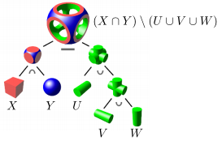

**表示方法：Distance Functions 距离函数**

Instead of Booleans, gradually blend surfaces together using Distance functions: 

giving minimum distance (could be signed distance)  from anywhere to object 

描述空间中任何一个点到几何表面的最近距离。（距离是可以取负的，可以定义几何外部的点到几何形体表面的距离为正，几何内部的点到几何形体表面的距离为负）

即将空间中的任何一点都定义值，将两个物体的距离函数都算出来做blending，再恢复成原来物体

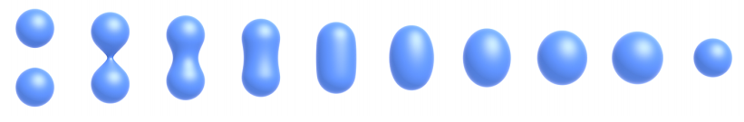

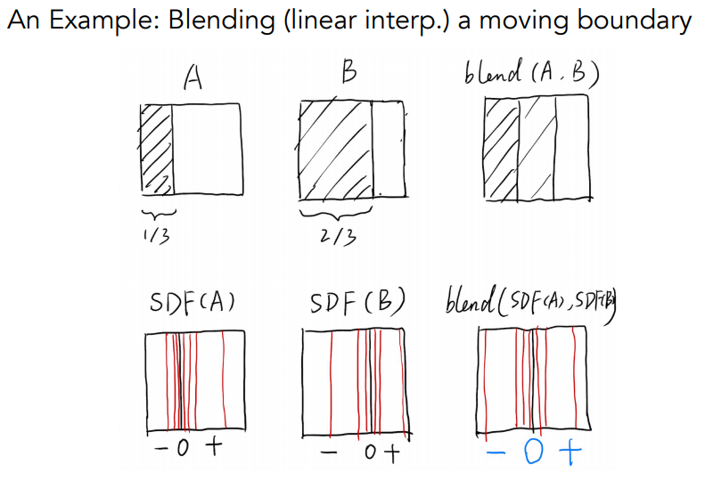

​	距离函数不必是f(x)=0的形式：

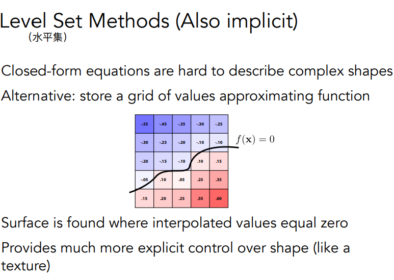

**表示方法：Fractals 分形**

​	Exhibit self-similarity, detail at all scales. “Language” for describing natural phenomena.Hard to control shape.

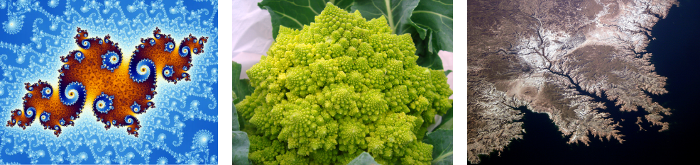

> 隐式表示
>
> Pros:
>
> - compact description (e.g., a function) 易于表示
> - certain queries easy (inside object, distance to surface) 易于查询
> - good for ray-to-surface intersection (more later)
> - for simple shapes, exact description / no sampling error
> - easy to handle changes in topology (e.g., fluid)
>
> Cons:
>
> - difficult to model complex shapes

### Explicit Representations 显式表示

**表示方法：Point Cloud 点云**

list of pointes (x,y,z)

1. Easily represent any kind of geometry
2. Useful for LARGE datasets (>>1 point/pixel)
3. Often converted into polygon mesh 通常转化为多边形面进行讨论
4. Difficult to draw in undersampled regions

**表示方法：Polygon Mesh 多边形面**

Store vertices & polygons (often triangles or quads)  

1. Easier to do processing / simulation, adaptive sampling
2. More complicated data structures  
3. Perhaps most common representation in graphic 最广泛应用的几何表示

常用的文件格式：The Wavefront Object File (.obj) Format

Commonly used in Graphics research

Just a text file that specifies vertices, normals, texture  coordinates and their connectivities

将空间中的点(v)、法线(vt)、纹理坐标(vn)进行定义，再定义之间的连接关系（f），从而定义完整的物体

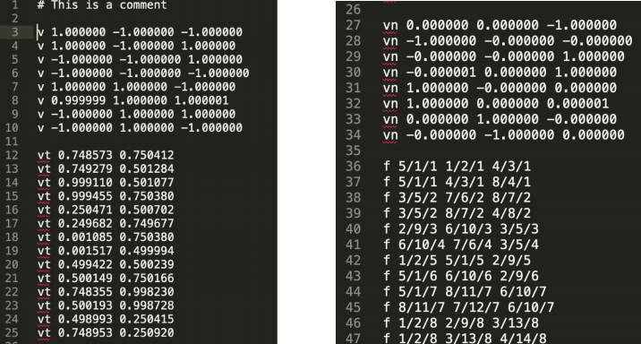

## Curves 曲线

### Bézier Curves 贝塞尔曲线

给定起始点、终止点、起始点处切线方向、终止点处切线方向，可以获得唯一的光滑曲线。So called “Bézier Curves”.

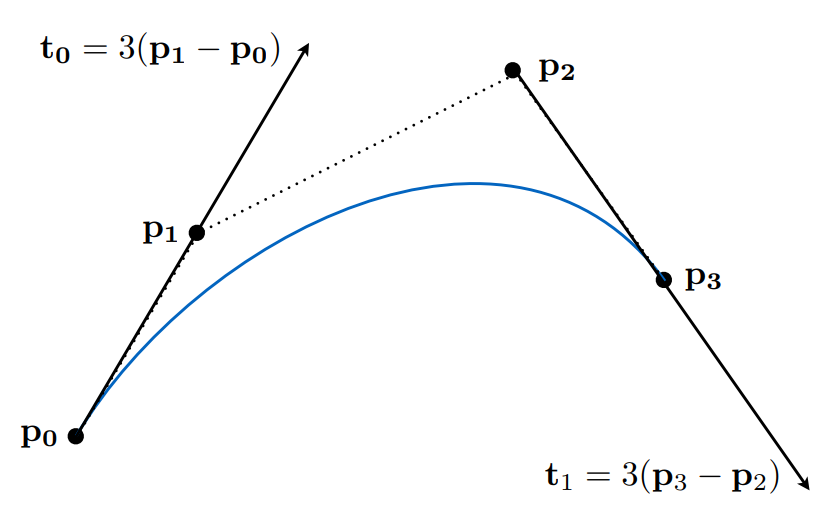

计算：**de Casteljau Algorithm**

> （直观上的解释，类递归）
>
> 
>
> **给定三个控制点**，生成了quadratic Bezier(二次贝塞尔曲线)。
>
> 设曲线从顶点$b_0$（对应时间$t=0$）到顶点$b_2$（对应时间$t=1$），求$t_0$时对应的曲线上的点。
>
> 则取满足$b_0b_0^1:b_0^1b_1=t:(1-t)$的一点$b_0^1$，满足$b_1b_1^1:b_1^1b_2=t:(1-t)$的一点$b_1^1$
>
> 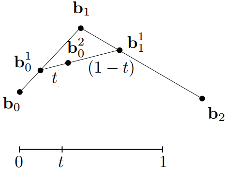
>
> 在$b_0^1b_1^1$上的$b_0^2$即为所求的。
>
> 
>
> 给定**四个控制点**：
>
> 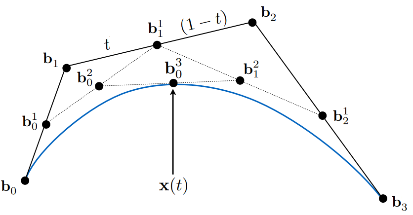

**Algebraic Formula 代数表示：线性插值的重复**

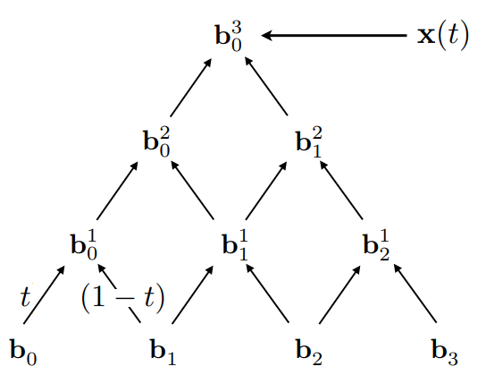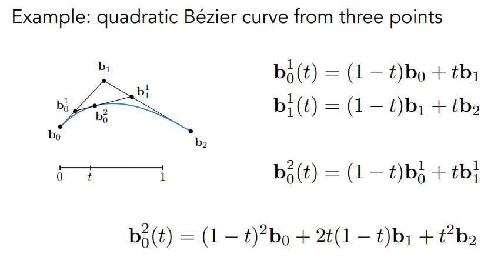

一般的，有由伯恩斯坦多项式Bernstein polynomials的加权累加：

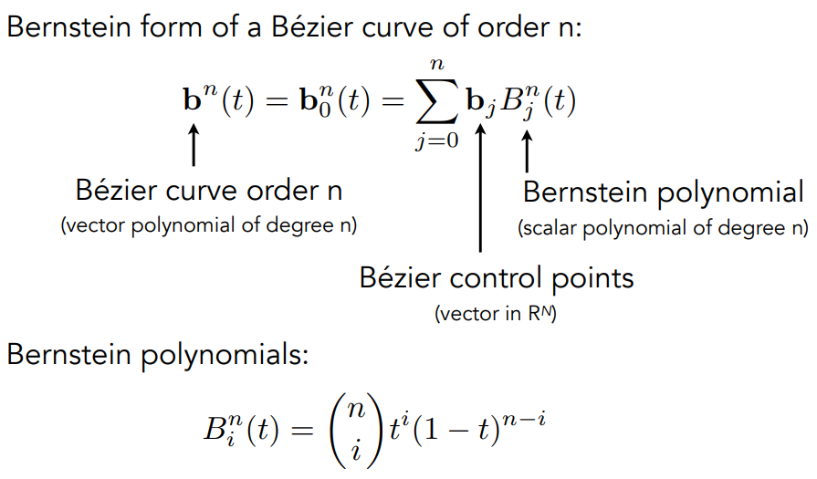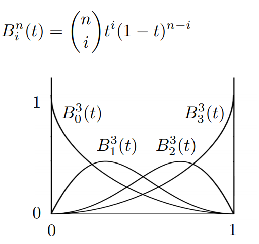

贝塞尔曲线的性质：

1. 必有起点和终点，且t=0时位于起点，t=0时位于终点。

2. 对于三次贝塞尔曲线（给定四个控制点的贝塞尔曲线）：$b^\prime(0) = 3(b_1-b_0); b^\prime(1)=3(b_3-b_2).$

3. Affine transformation 仿射变换性质

   对控制点做仿射变换后生成的贝塞尔曲线与对贝塞尔直接做仿射变换是效果是相同的。

4. Convex hull property 凸包性质

   凸包：包围几何形体的最小凸多边形。贝塞尔曲线在几个控制点形成的凸包内。

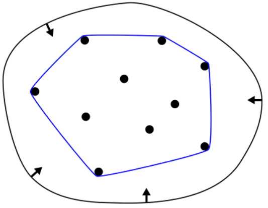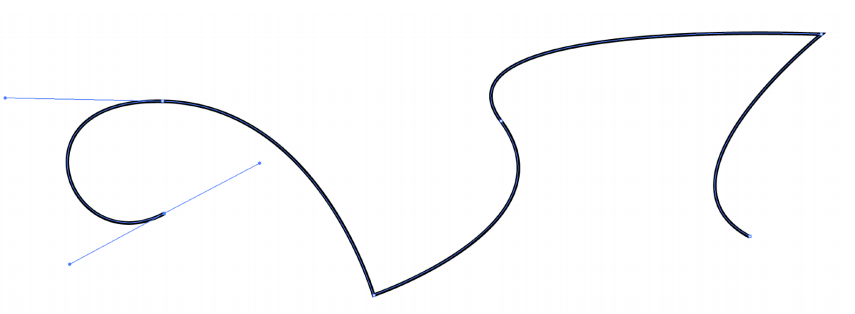

### Piecewise Bézier Curves 逐段贝塞尔曲线

控制点过多时，不便控制曲线形成想要的形状。可以考虑定义多个贝塞尔曲线进行合成（上图右）。

习惯上，每四个控制点定义一条贝塞尔曲线。

**连续性 Continuity**：

- $C^0$连续：第一段终止点等于第二段起点 $a_n=b_0$

- $C^1$连续：在C^0的基础上，一阶导数连续。 $a_n=b_n=(a_{n-1}+b_1)/2$

### Other types of splines 更多类型的样条

**Spline**:a continuous curve constructed so as to pass through a given set  of points and have a certain number of continuous derivatives.In short, **a curve under control**.

**B-splines**: 贝塞尔曲线的拓展。改变一个点只影响曲线的一定范围，在不分段的基础上更加容易控制。

**NURBS**: 非均匀有理B-splines(B样条)。

To learn more / deeper, you are welcome to refer to  Prof. Shi-Min Hu’s course: 

[https://www.bilibili.com/video/ av66548502?from=search&seid=65256805876131485](https://www.bilibili.com/video/ av66548502?from=search&seid=65256805876131485)

## Surfaces 曲面

两个方向同时应用贝塞尔曲线：贝塞尔曲面 Bicubic Bézier Surface Patch

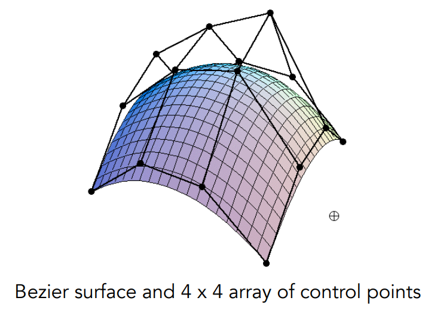

$f(u,v)=(x,y,z)$

## Mesh Operations: Geometry Processing 几何处理

- Mesh subdivision 面的细分
- Mesh simplification 面的简化
- Mesh regularization 面的正规化（将所有三角形近似为正三角形）

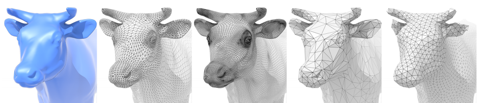

### Subdivision 细分

Common subdivision rule for triangle meshes

First, create more triangles (vertices) 引入更多三角形

Second, tune their positions 调整位置

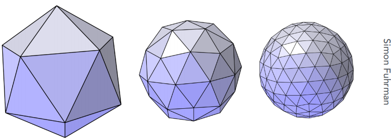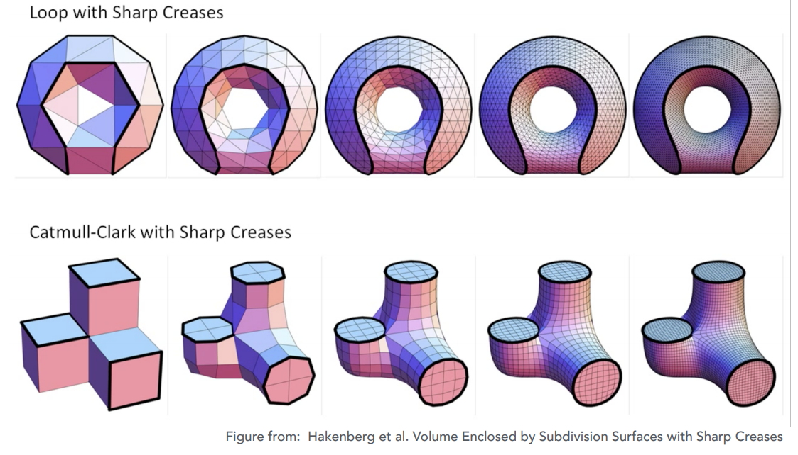

> **Loop Subdivision**
>
> 1. Split each triangle into four 一分为四
>
> 2. Assign new vertex positions according to weights 调整位置
>
>    **New / old vertices updated differently**
>
> 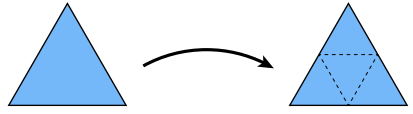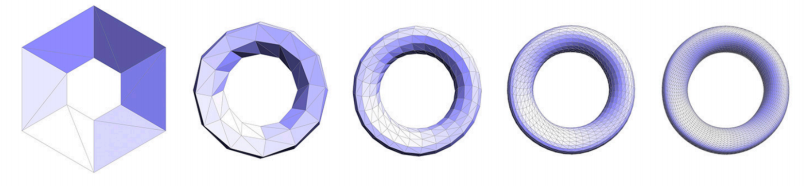
>
> 
>
> 如何调整位置？
>
> - 对新的顶点（如左图的白点），使它的位置位于$3/8*(A+B)+1/8*(C+D)$
>
> - 对旧的顶点（如右图），设顶点的度$n$（vertex degree, 顶点连接的边数），常数$u$
>
>   使它的位置位于(1-n*u)*origin_position+u*neighbor_position_sum
>
> 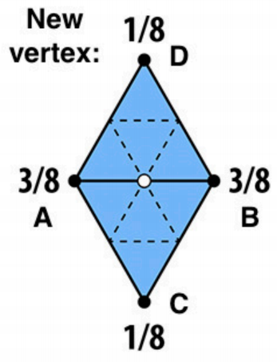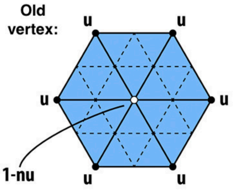

如果不是三角形网格，是一般的面，则可以考虑Catmull-Clark Subvision

> Catmull-Clark Subvision (General Mesh)
>
> ***定义概念：***
>
> *quad face 四边形面，non-quad face 非四边形面，* 
>
> *Extraordinary vertex 奇异点（degree !=4）.*
>
> **具体算法：**
>
> 对于每一条边、每一个面都取其中点，将所有中点进行连接
>
> 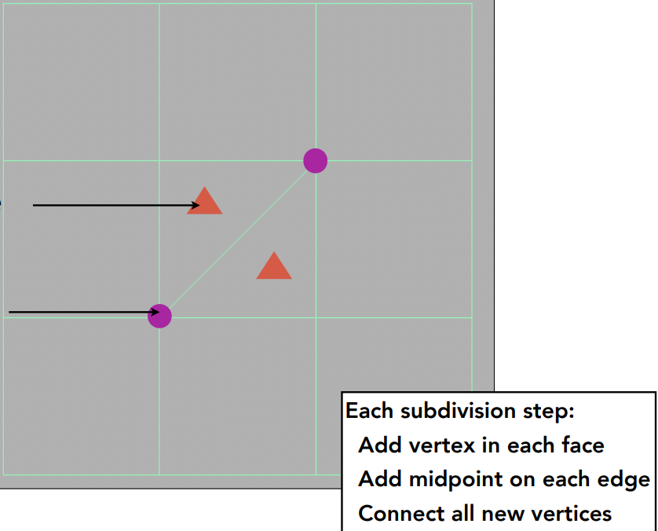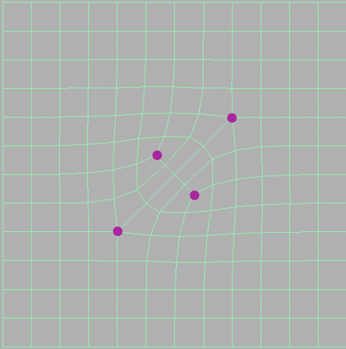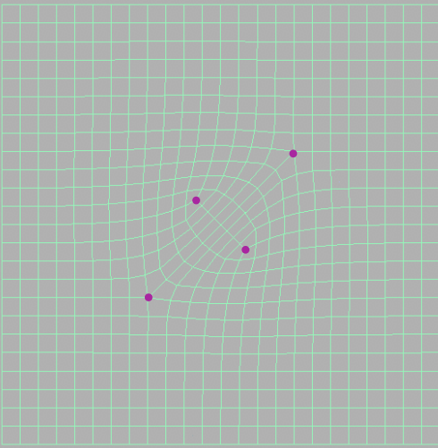
>
> **性质分析：**
>
> 经过一次细分之后还有多少个奇异点？非四边形面内的点形成的点一定是奇异点。
>
> 第二次细分之后，所有非四边形面消失，变成了四边形面。
>
> 
>
> 经过一次细分之后，应该如何**调整位置**？（平均）
>
> 定义三种点： Face Point, Edge Point, Vertex Point;
>
> 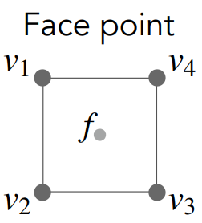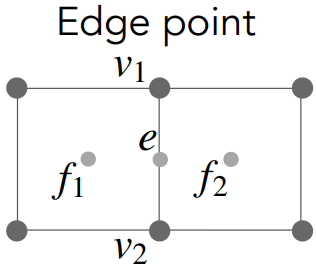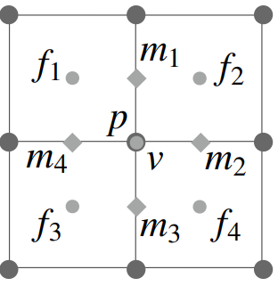
> $$
> f=\frac{v_1+v_2+v_3+v_4}{4}\\
> e=\frac{v_1+v_2+f_1+f_2}{4}\\
> v=\frac{f_1+f_2+f_3+f_4+2(m_1+m_2+m_3+m_4)+4p}{16}\\
> $$

### Simplification 简化

Goal: reduce number of mesh elements  while maintaining the overall shape.

难题：几何的层次结构

很多时候没有必要用到非常复杂的结构，可以做网格上的简化。但如何在不同的场景动态表现出不同的简化程度的几何形体，仍是难以解决的问题。

Suppose we simplify a mesh using edge collapsing。

网格简化的一种方法： Coilapsing An Edge 边坍缩(Edge Collapsing)

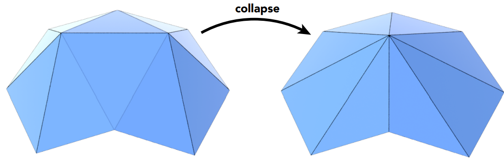

生成的一个点放到哪里？

Quadric Error Metrics 二次误差度量

“二次误差” 一个新的点与原本的几个面都有关系，只需求一个位置，使其到几个面的距离的平方和有最小。new vertex should minimize its **sum of square  distance (L2 distance)** to previously related triangle planes!

通过优先队列/堆更新

Iteratively collapse edges

Which edges? Assign score with quadric error metric*  

- approximate distance to surface as sum of distances to  planes containing triangles 
- iteratively collapse edge with smallest score
- greedy algorithm... great results!

*Garland & Heckbert 1997*

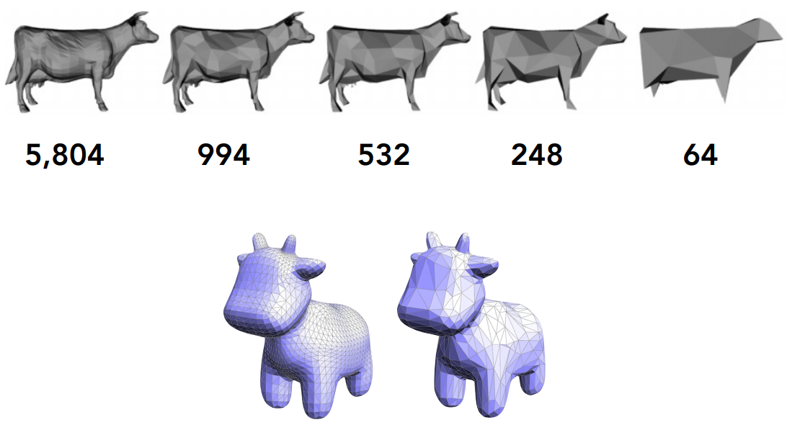

