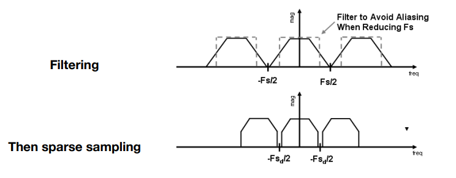

[TOC]


# Rasterization 光栅化 (lec 5,6)

Several Basic Conception: 

**What is a screen?**

- an array of pixel(‘FYI’)

- Size of the array: resolution

- A typical kind of raster display

  (raster means screen in German. raserize means ‘drawing onto the screen’)

**What is pixel?**

- Color is a mixture of (red, green, blue)
- Pixels’ indices are from  (0, 0) to (width - 1, height - 1)
- Pixel (x, y) is centered at (x + 0.5, y + 0.5)
- The screen covers range  (0, 0) to (width, height)

**Canonical Cube to Screen**

1. Irrelevant to z

2. Transform in xy plane: $[-1, 1]^2$ to [0, width] x [0, height]

   Viewport transform matrix:

$$
M_{view}=
\begin{bmatrix}
\frac {width}{2}&0&0&\frac {width}{2}\\
0&\frac {height}{2}&0&\frac {height}{2}\\
0&0&1&0\\
0&0&0&1
\end{bmatrix}
$$

## Rastering one Triangles

Triangles: Fundamental Shape Primitives

**Why triangles?**

- Most basic polygon
  - Break up other polygons
  - Unique property
- Unique properties
  - Graranteed to be planar
  - Well-defined interior

**What Pixel Values Approximate a Triangle?**

- A Simple Approach: **Sampling**

  We can <u>discretize</u> a function by sampling. Sample if Each Pixel is inside triangle.

  1. Define binary function: inside(t,x,y)

     return 1 if Point (x,y) in triangle t, or return 0

     **Realization:** The Cross Products 

     $\vec {P_1P_2} \times \vec {P_1Q} > 0$ if Q is locating left side of $\vec {P_1P_2}$

     

     We could realize inside() after 3 times judgement.

     *Edge Cases: it depends*

  2. Sampling a 2D indicator function

     ```cpp
     for (int x = 0; x < xmax; ++x) 
     	for (int y = 0; y < ymax; ++y) 
     		image[x][y] = inside(tri,x + 0.5,y + 0.5);
     ```

     **Optimize**: no need to checking all pixels on the screen

     - check each vertex before use a Bouding Box(AABB).

     - Suitable for thin and rotated triangles.

## Sampling Theory 采样原理

采样对象：不同位置（将图像信息离散为像素），不同时间（将连续过程离散成每一帧）

Sampling Artifacts (Errors, Mistakes, Inaccuracies): 

- Jaggies - sampling in space
- Moire Patterns - undersampling images
- Wagon Wheel Effect - sampling in time

Sampling：Repeating  Frequency Contents

### Frequency Domain 频域

**Fourier Transform**: Represent a function as a weighted sum of sines and cosines


### Flitering 滤波 (Convolution, Averaging)

**Filter 滤波**: Getting rid of certain frequency contents

Fourier Transform: 时域 -> 频域（中心：最低频区域；周围：最高频区域）


> - High-pass filter (Filter Out Low Frequencies Only, Edges) 高通滤波     
>
> - Low-pass fliter (Filter Out High Frequencies Only, Blur) 低通滤波     
>
> - Filter Out Low and High Frequencies 
>
>     


**Convolution 卷积**在图形学上的简化定义：

对原始信号对应位置的值及其周围位置的值作加权平均，结果是其卷积后对应位置的值。

**Convolution Theorem**: 

Convolution in the spatial domain is equal to multiplication in the frequency domain, and vice versa

时域上的卷积对应频域上的乘积

> Option 1:
>
> - Filter by convolution in the spatial domain
>
> Option 2:
>
> - Transform to frequency domain (Fourier transform) 时域到频域
> - Multiply by Fourier transform of convolution kernel 频域进行乘积
> - Transform back to spatial domain (inverse Fourier) 频域还原到时域


## Antialiasing 反走样

**Aliases 走样**: Two frequencies that are indistinguishable at a given sampling rate.

Blurring (Pre-Filtering) Before  Sampling 模糊/滤波 后再采样

Aliasing: Mixed Frequency Contents

> How Can We Reduce Aliasing Error?
>
> Option 1: Increase sampling rate
>
> - Essentially increasing the distance between replicas in the  Fourier domain
>
> - Higher resolution displays, sensors, framebuffers…
>
>   But: costly & may need very high resolution
>
> Option 2: Antialiasing
>
> - Making Fourier contents “narrower” before repeating
>
>   i.e. **Filtering out high frequencies before samplin**




> Antialiasing By Averaging Values in Pixel Area
>
> Solution: 
>
> - Convolve f(x,y) by a 1-pixel box-blur (low pass, blurring)
>
>   Recall: convolving = filtering = averaging
>
> - Then sample at every pixel’s center

In rasterizing one triangle, the average value inside a pixel  area of f(x,y) = inside(triangle,x,y) is equal to the area of the  pixel covered by the triangle.


#### Antialiasing By Supersampling  (MSAA)

> Step 1: Take NxN samples in each pixel.
>
> Step 2: Average the NxN samples “inside” each pixel.
>
> 

The Cost of MSAA: 更多的计算量


更多的抗锯齿方案：

- FXAA(Fast Approximate AA) 得到含锯齿的图像，通过图像匹配找到锯齿边界，进行后期替换
- TAA(Temporal AA) 根据上一帧信息进行合成

Super Resolution（超分辨率，将高分图进行还原）

- From low resolution to high resolution
- Essentially still “not enough samples” problem
- DLSS (Deep Learning Super Sampling)

## Visibility/Occlusion 可见性

> Z-Buffer
>
> - Store current min. z-value for each sample (pixel)
> - Needs an additional buffer for depth values 
>   - frame buffer stores color values
>   - depth buffer (z-buffer) stores depth
>
> *IMPORTANT: For simplicity we suppose  z is always positive*
>
> *(smaller z -> closer, larger z -> further)*

 **Z-Buffer Algorithm**

Initialize depth buffer to $\infty$

```python
for(each triangle T)
    for(each sample(x,y,z) in T)
    	if(z<zbuffer[x,y])				//如果更浅
        	framebuffer[x,y] = rgb;		//更新颜色
            zbuffer[x,y] = z;			//更新深度
        else
```

默认深度为无限大，每一个像素内记录最浅深度与颜色，从而维护出逐像素的渲染结果/深度图。


Z-Buffer Complexity 复杂度：O(n) for n triangles

