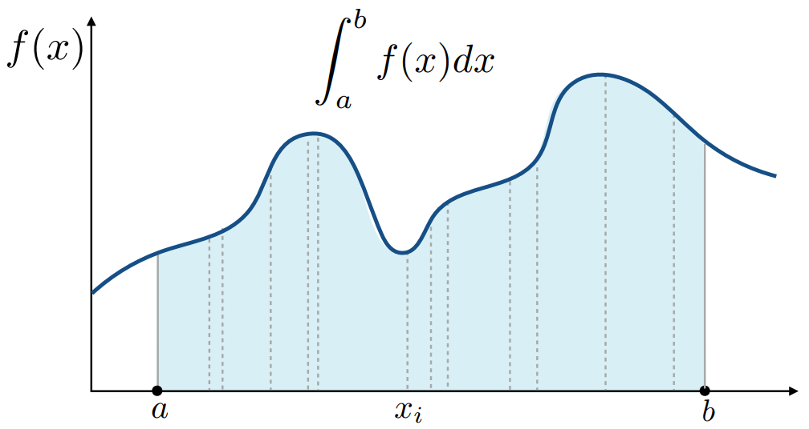

[TOC]


# Ray tracing 光线追踪

Whitted-Style Ray Tracing

> Why Ray Tracing？
>
> Cons: Accurate
>
> ​	comparing to rasterizer, Ray tracing could  handle global effects.
>
> - soft shadow 软阴影
> - glossy reflection 高斯模糊的反射效果
> - Indirect illumination 间接光照（到人眼之前，光线弹射可以不止一次）
>
> Pros: very slow

Rasterizer: real-time; Ray tracing: offline


## 基本光线追踪原理

**Light Rays 光线**

三点假设：

1. 光线沿直线传播
2. 光线与光线不会发生碰撞，互不相干
3. 光线由光源出发到达眼睛（可逆的：目光由眼睛出发到达光源，光路不改变）

光线追踪：从相机开始

**Ray Casting 光线投射**

从照相机开始，向成像平面image plane投射出一道光线eye ray(primary ray)，打到光线所经过的最近的物体（和场景中物体的**最近一点**）。

考虑该点是否会被照亮，从该点向光源连接一根光线，若光线没有物体阻挡，则该点为亮；否则为暗。


### Recursive (Whitted-Style) Ray Tracing 递归光追


### Ray-object intersections

**求解：光线到物体表面的交点 Ray-Surface Intersection**

> <u>**Ray 光线**</u>
>
> Ray is defined by its orgin and a direction vector. Ray Equation: 
>
> 
>
> **<u>Sphere 球</u>**
>
> 
>
> **光线和球的交点：**
>
> 联立展开，
>
> $t=\frac{-b\pm\sqrt{b^2-4ac}}{2a}$解二次函数
>
> **求解：光线到隐式表面的交点**
>
> 对于$r(t)=\vec o + t\vec d$到隐式表面$p:f(p)=0$，只需解出$f(\vec o+t\vec d)=0$


**判断：一个点是否在物体内部**

> 对于一个点，作过点的光线（射线），如果光线与几何形体的交点数为奇数，则在物体内部；如果是偶数，则在物体外。适用于2D与3D。


**光线与三角形求交 Ray Intersection With Triangle Mesh**

> <u>Method 1</u>:
>
> - Simple idea: just intersect ray with each triangle (Simple, but slow)
>
> <u>Method 2</u>:
>
> - 不妨分解为两个问题：光线与平面求交；判断点是否在三角形内insideTriangle
>
>   点法式定义平面：只须由$p:(p - p^\prime)N=0$ 来给定平面，其中$p\prime$是平面上任意一点，$N$是平面法向量。
>
>   带入$p=r(t)=o+td$即可得$t=\frac{(p\prime-o)N}{dN}$
>
> <u>Method 3</u>: 
>
> - Moller Trumbore Algorithm**
>
>   $\vec O+t\vec D=(1-b_1-b_2)\vec P_0+b_1\vec P_1+b_2\vec P_2$
>
>   使用Cramer法则得到解，判断解是否合理（$t$为正，点在三角形内即$b_1,b_2,(1-b_1-b_2)$都是非负的）


## Accelerate 加速结构

### Bounding Volumes 包围盒

用一个盒子将物体包起来，如果光线连包围盒都碰不到，是不可能碰到物体的。

如果盒子是长方体，长方体即三个对面(3 pairs of slabs)形成的交集。

通常考虑**<u>轴对齐包围盒(Axis-Aligned Bounding Box, AABB)</u>** 。

判断光线与盒子是否有交点

2D example:


The ray <u>enters</u> the box <u>only when</u> it enters all pairs of slabs;

The ray <u>exits</u> the box <u>as long as</u> it exits any pair of slabs.

- However, ray is not a line 

  Should check whether t is negative for physical correctness!

- What if texit < 0?

  The box is “behind” the ray — no intersection!

- What if texit >= 0 and tenter < 0?

  The ray’s origin is inside the box — have intersection!

- In summary, ray and AABB intersect iff(当且仅当)

  $t_{enter} < t_{exit} $&&$ t_{exit} >= 0$

轴对齐时，各种计算会相对容易。


### 使用AABB加速光追

（预处理方法）

1. Find bounding box

2. Create grid（将盒子划分为格子）

3. Store each object in overlapping cells（判断哪些格子中有物体）

4. 做若干次光线与盒子的求交，若相交再判断是否和物体相交

   （为了效率，也就要求格子不能太稀疏也不能太密集）

   

#### Uniform Spatial Partitions (Girds) 空间划分


Oct-Tree 八叉树（二维情况下是四叉树，计算复杂度与维度有关）

**KD-Tree** 每次只沿轴进行<u>一次划分</u>，讨论对象

BSP-Tree 不横平竖直的AABB（计算复杂度与维度有关）


KD-Tree 的建立：

Internal nodes store

- split axis: x-, y-, or z-axis

- split position: coordinate of split plane along axis

- children: pointers to child nodes

- No objects are stored in internal nodes

  Leaf nodes store list of objects


Traversing a KD-Tree


KD-Tree 的问题：

难以判定物体和包围盒相交。给定AABB包围盒，难以判断它与一个平面中的哪些三角形有交集。

物体可能在多个格子中。


#### Object Partitions 物体划分

对应的加速结构：**Bounding Volume Hierarchy (BVH)**

1. 找到一个包围盒
2. 递归，按照物体将包围盒拆成两个部分
3. 重新计算子部分的包围盒
4. Stop when necessary

(Store objects in each leaf)


BVH中，每一个几何结构只存在于一个对应节点当中。但如何划分是一个问题。

如何划分：按照不同维度划分节点。

​	Heuristic#1: 每一次划分中，总是沿着最长轴进行划分。

​	Heuristic#2: 选取中间物体median object进行划分。（让这个树更平衡）

对于动态场景，只能重新计算BVH。


**BVH Traversal**

```
Intersect(Ray ray, BVH node) {
 	if (ray misses node.bbox) return;
 	
    if (node is a leaf node)
 		test intersection with all objs;
		return closest intersection;
 	
    hit1 = Intersect(ray, node.child1);
	hit2 = Intersect(ray, node.child2);

    return the closer of hit1, hit2;
}
```


**Spatial vs Object Partitions**

Spatial partition (e.g.KD-tree)

- Partition space into  non-overlapping regions
- An object can be contained  in multiple regions 

Object partition (e.g. BVH)

- Partition set of objects into  disjoint subsets
- Bounding boxes for each set  may overlap in space


## Basic radiometry 辐射度量学

*Way of learning things:* 

*Why learn? What it is? How to use?*

为什么讨论Radiometry？

对于光进行精准的定义和描述，最终重现真正的物理法则。

辐射度量学：描述真实的光照。但仍旧基于几何光学（光沿直线传播，无干涉等现象）。

### Radiant Energy and Flux (Power)

Definition: **Radiant energy** is the energy of electromagnetic  radiation. It is measured in units of joules, and denoted by  the symbol 
$$
Q[J=Joule]
$$
Definition: **Radiant flux (power)** is the energy emitted,  reflected, transmitted or received, per unit time.单位时间的Radiant energy，功率
$$
\Phi = \frac{dQ}{dt}[W=Watt][lm=lumen]^\star
$$
Flux: 单位时间通过某感光平面的光子数量。


讨论三个对象：光源辐射能量，物体表面接收能量，光线传播中能量的度量


### Radiant Intensity

Definition: The **radiant (luminous) intensity** is the power per unit  solid angle (立体角) emitted by a point light source.一个立体角上的能量（单位时间）
$$
I(\omega)\equiv\frac{d\phi}{d\omega} [\frac{W}{sr}][\frac{lm}{sr}=cd=candela]
$$


**Angles and Solid Angles**

> **Angle**: 
>
> - ratio of subtended arc length on circle to radius $\theta=\frac{l}{r}$ (circle has $2\pi$ radians)
>
> **Solid Angle**: 
>
> - $\Omega = \frac{A}{r^2}$ (Sphere has $4\pi$ <u>steradians</u>)
>
> **differential solid angles**（单位立体角/微分立体角）：
>
> -  $A/r^2$。单位立体角的积分是$4\pi$
>
> 

**Isotropic Point Source**

某一方向上的强度


### Irradiance

Definition: The irradiance is the **power per unit area** incident  on a surface point.


关联Blinn-Phong Model中的Lambert’s Cosine Law。

在Irradiance Falloff模型中，衰减的不是intensity， 是irradiance。

### Radiance

Radiance is the fundamental field quantity that describes the  distribution of light in an environment.

Definition: The radiance (luminance) is the **power** emitted,  reflected, transmitted or received by a surface, **per unit solid  angle, per projected unit area**. 从某个方向打到某个面上，面接受的能量。


Difference among three def:

- Irradiance: power per projected unit area

- Intensity: power per solid angle 

- Radiance: Irradiance per solid angle

  Radiance: Intensity per projected unit area

Difference between Irradiance and Radiance:

- Irradiance: total power received by area $dA$

- Radiance: power received by area $dA$ from “direction” $d\omega$


## BRDF 双向反射分布函数

**Bidirectional Reflectance Distribute Function（BRDF，双向反射分布函数）**

BRDF可以描述在反射过程中从某个方向进来、向某个方向分散时反射能量的多少(如何向每个方向分配能量)，也即描述光线与物体是如何作用的。

“BRDF”定义了材质。


**Reflection at a Point**

（理解）反射：光线从某个角度打到物体某个位置上，被表面吸收后再向外发出。

Radiance -> Irradiance -> Radiance


由此推导出渲染方程。


考虑的radiance可能不止来自某一特定光源，也可能是其它物体的漫反射（二次反射），这是一个递归的问题。

**The Rendering Equation 渲染方程**

一个点的光=自己发的+反射别人的

$$
L_r(p,\omega_o)=L_e(x,\omega_o)+\int_{\Omega^+(H^2)} L_i(x,\omega_i)f(p,\omega_i,\omega_o)(\omega_i\cdot n)\,d\omega_i
$$


点光源场景：


面光源场景：


对于方程：

可以简写为(u,v是两个不同位置)：
$$
l(u)=e(u)+\int l(v)K(u,v)dv\\
或\\
L=E+KL\\
（所有能量等于所有光源辐射出来的能量加上辐射出来被反射的能量）
$$
其中$K(u,v)dv$是Kernel of equation

推导时，写成算子形式，可以方便Taylor展开：
$$
L=E+KL\\(I-K)L=E\\L=(I-K)^{-1}E\\L=(I+K+K^2+K^3+...)E （泰勒展开）\\L=E+KE+K^2E+K^3E+...(*)
$$
物理意义上的理解：L=光源+光源弹射一次+光源弹射两次+…

另一种理解：Ratserization可以做到的就是$E+KE$，而Ray Tracing可以做到更多项的效果。

## 概率论与蒙特卡洛积分

**Probability**

1. 随机变量radom variable与概率分布 $X$~$p(x)$

2. Probabilities 概率 $p_i\geq 0, \sum_{i=1}^{n} p_i=1$

3. 期望 Expected Value of a Radom Variable $E[X]$

4. 连续情况描述概率分布：概率密度函数Probability Density Function (PDF)

    $X$~$p(x)$。PDF满足归一化性质。

**积分方法：蒙特卡洛积分 Monte Carlo Integration**

积分域内不断采样，对每一个划分出的近似的长方形进行积分。



具体操作：

1. 定义积分：Define integral $\int_a^bf(x)dx$
2. PDF采样：Uniform random variavle $X_i$~$p(x)=\frac{1}{b-a}$
3. 除N求平均，得到对定积分的估计Basic Monte Carlo estimator $F_N=\frac{b-a}{N}\sum_{i=1}^Nf(X_i)$

In general:
$$
\int f(x)dx=\frac{1}{N}\sum^N_{i=1}\frac{f(X_i)}{p(X_i)}\quad X_i\sim p(x)
$$
Some notes:

- The more samples, the less variance
- Sample on x, integrate on x

## Path Tracing 路径追踪

Motivation: Whitted-Style Ray Tracing

Progress: 对于glossy材质，不能沿镜面反射；全局光照


解出渲染方程：
$$
L_o(p,\omega_o)=\int_{\Omega^+} L_i(p,\omega_i)f_r(p,\omega_i,\omega_o)(\omega_i\cdot n)\,d\omega_i
$$
Use Monte Carlo Solution to solve the integral numerically.

考虑着色点是p点。按蒙特卡洛积分：
$$
\int f(x)dx=\frac{1}{N}\sum^N_{i=1}\frac{f(X_i)}{p(X_i)}\quad X_i\sim p(x)
$$
其中，$f(x)$是$L_i(p,\omega_i)f_r(p,\omega_i,\omega_o)(\omega_i\cdot n)$;

可考虑均匀采样（任何方向概率密度是相同的）得到pdf:$p(\omega_i)=1/2\pi$

则有：
$$
L_o(p,\omega_o)\\=\int_{\Omega^+} L_i(p,\omega_i)f_r(p,\omega_i,\omega_o)(\omega_i\cdot n)\,d\omega_i\\
\approx\frac{1}{N}\sum^N_{i=1}\frac{L_i(p,\omega_i)f_r(p,\omega_i,\omega_o)(\omega_i\cdot n)}{1/2\pi}
$$
由此可得任何一个着色点出射的光线多少（直接光照，并引入全局光照）

```
shade(p, wo)
	Randomly choose N directions wi~pdf
	Lo = 0.0
	For each wi # 对于任意选中方向
		Trace a ray r(p, wi) # 从p点向该方向连出一条光线
		If ray r hit the light # 如果光线打到光源
			Lo += (1 / N) * L_i * f_r * cosine / pdf(wi)
        Else If ray r hit an object at q # 如果光线打到物体
			Lo += (1 / N) * shade(q, -wi) * f_r * cosine / pdf(wi)
	Return Lo
```

存在的问题：

1. 光线数量会爆炸，性能有限

   O(n^i)，不妨i取1，每个物体只选取一根光线。(But this will be noisy)

   *n=1时称为**路径追踪**，否则为分布式路径追踪*

   

   则有优化：

   ```
   ray_generation(camPos, pixel)
   	Uniformly choose N sample positions within the pixel
   	pixel_radiance = 0.0
   	For each sample in the pixel
   		Shoot a ray r(camPos, cam_to_sample)
   		If ray r hit the scene at p
   			pixel_radiance += 1 / N * shade(p, sample_to_cam)
       Return pixel_radiance
   ```

   

2. 这是递归的，没有给定递归停止条件

   解决：俄罗斯轮盘赌 Russian Roulette

   Russian Roulette is all about probability

   - With probability 0 < P < 1, you are fine
   - With probability 1 - P, otherwise

   在具体递归中，递归执行的概率为P，则能量的期望为：
   $$
   E=P(L_o/P)+(1-P)*0=L_o
   $$
   利用期望，结果可能有噪声noisy但在可接受的范围内。有优化代码：

   ```
   shade(p, wo)
   	Manually specify a probability P_RR
   	Randomly select ksi in a uniform dist. in [0, 1]
   	If (ksi > P_RR) return 0.0;
   
   	Randomly choose ONE direction wi~pdf(w)
   	Trace a ray r(p, wi)
   	If ray r hit the light
   		Return L_i * f_r * cosine / pdf(wi) / P_RR
   	Else If ray r hit an object at q
   		Return shade(q, -wi) * f_r * cosine / pdf(wi) / P_RR
   ```

   仍旧存留的问题：不高效。**采样少Low SPP(samples per pixel)时噪点很多**。

   由于是向四面八方均匀采样，很多光线都是浪费的。我们希望直接在光源上采样。

   希望直接在光源上采样，但渲染方程是定义在半球上的。

   在光源面积上采样vs.在半球立体角上的积分，矛盾，需要把渲染方程写成在光源面积的积分。

   对此，只须知道$dA$和$d\omega$的关系：（已知立体角是在r=1的半球上面积除以距离的平方$A/r^2$）

   

   由此可重写渲染方程：

   

   此时直接对光源进行采样，便无须俄罗斯轮盘赌，有优化代码：

   ```
   shade(p, wo)
   	# Contribution from the light source. 来自光源的贡献（不涉及多次弹射）
   	Uniformly sample the light at x’ (pdf_light = 1 / A) # 均匀采样
   	Shoot a ray from p to x’ # 判断有无遮挡物体，取连线
   	If the ray is not blocked in the middle # 如果没有被遮挡，进行计算
   		L_dir = L_i * f_r * cos θ * cos θ’ / |x’ - p|^2 / pdf_light 
   	
   	# Contribution from other reflectors.
   	L_indir = 0.0
   	Test Russian Roulette with probability P_RR
   	Uniformly sample the hemisphere toward wi (pdf_hemi = 1 / 2pi)
   	Trace a ray r(p, wi)
   	If ray r hit a non-emitting object at q #打到非光源的点q
   		L_indir = shade(q, -wi) * f_r * cos θ / pdf_hemi / P_RR
   
   	Return L_dir + L_indir
   ```

   

在路径追踪中，点光源难以处理。在实际中，考虑将其作为小的面积光源处理。

路径追踪可以做到照片级真实感。


**Ray Tracing&Path Tracing**

Previous

- Ray tracing == Whitted-style ray tracing

Modern (my own definition)

- The **general solution of light transport**, including 不同的光线传播方法

  (Unidirectional & bidirectional) path tracing 单向&双向路径追踪

  Photon mapping 光子映射

  Metropolis light transport 光线传输

  VCM / UPBP…


遗留问题：

1. Uniformly sampling the hemisphere  - How? And in general, how to sample any function?  (sampling) 均匀采样的理论与实践
2. Monte Carlo integration allows arbitrary pdfs  - What's the best choice? (importance sampling) 怎样对于特定形状函数采取最适合的采样方法
3. Do random numbers matter?  - Yes! (low discrepancy sequences) 如何生成好的随机数lds？
4. I can sample the hemisphere and the light  - Can I combine them? Yes! (multiple imp. sampling)  如何通过MIS将不同的采样方法结合起来？
5. The radiance of a pixel is the average of radiance on all  paths passing through it  - Why? (pixel reconstruction filter) 各路径radiance的平均是否真的是像素的radiance的平均，是否需要加权？
6. Is the radiance of a pixel the color of a pixel?  - No. (gamma correction, curves, color space) radiance置换成颜色需要进行gamma矫正
7. Asking again, is path tracing still “Introductory”?  - This time, yes. Fear the science, my friends.
