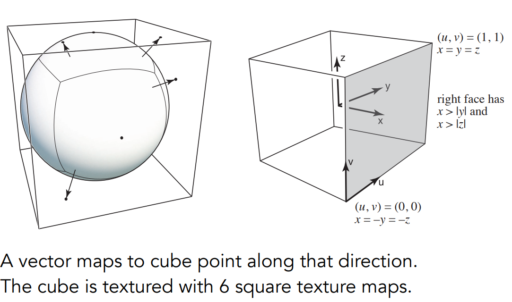

[TOC]

NIAGARA

# Shading

Shading: The process of applying a material to an object.

## Blinn-Phong Reflection Model

**Shading is Local 局部着色**

定义几个量：

View direction, v

Surface normal, n

Light direction, l

Surface parameters (color, shininess, …)

No shadows will be generated. 着色不考虑其它物体的存在，只考虑其自身，没有阴影。

考察一个点是什么样的亮度、有怎样的颜色，需要考虑**漫反射(Diffuse)、高光(Specular)、环境光(Ambient)**。

### Diffuse Reflection 漫反射

**物体对光线（能量）的接收**: Lambert’s cosine law

How much light (energy) is received?  Lambert’s cosine law.

Lambert余弦定律说明，接收到的光线能量，与接收方向和法线方向的夹角的余弦，成正比。

**物体辐射/发散的光线（能量）的到达 Light Falloff **: 接收的强度与和到光源的距离成平方反比

**Lambertian (Diffuse) Shading**

$L_d = k_d(I/r^2)max(0,n\cdot l)$

$k_d$ 是漫反射系数。它可以是一个三通道的颜色RGB值，用于定义颜色（吸收某些颜色，不吸收某些颜色）。

### Specular Term 高光

- Intensity depends on view direction. Bright near mirror reflection direction.

  视向角度越接近于反射角度，所接收的光强越强。

- 通过v和l接近判断h和n接近，选取半程向量half vector $h$进行衡量。

​		其中指数p来控制高光可见，一般选取100-200。

### Ambient Term 环境光

假设：任何点所接收的环境光都是相同的。环境光是常数：$L_a=k_aI_a$

Add constant color to account for disregarded  illumination and fill in black shadows.

**This is approximate / fake!**

### Blinn-Phong Reflection Model

$L=L_a+L_d+L_s=k_aI_a+k_d(I/r^2)max(0,\vec n \cdot \vec l)+k_s(I/r^2)max(0,\vec n \cdot \vec h)^p$

## Shading Frequencies 着色频率

着色应用于每一个顶点，用插值方法连起来。

- Shade each triangle (**Flat Shading**) 通过**三角形**的面作法线进行确定

- Shade each vertex (**Gouraud Shading**) 求**顶点**的法线，三个顶点固定三角形，通过插值计算内部颜色
- Shade each pixel (**Phong Shading**) 对每一**像素**进行着色

**Defining Per-Vertex Normal Vectors 定义逐顶点法线**

对特定空间几何形状按几何知识求法线；

对一般几何形状对顶点所关联的面的法线求平均（可能需要加权）。

**Defining Per-Pixel Normal Vectors 定义逐像素法线**

Barycentric interpolation of vertex normals 重心坐标

（法线注意应该归一化：所有法线都是方向向量）

## Graphics Pipeline

Real-time Rendering 图形/实时渲染管线

管线：表示一系列不同操作。

- **Vertex Processing** 对顶点的MVP变换 Model, View, Projection transforms

- **Rasterization** 对屏幕中每一个像素进行采样，判断insideTriangle

- **Fragment Processing** 可见性判断  Z-Buffer

- Shading考虑顶点如何着色与像素如何着色，发生在**Vertex Processing**与**Fragment Processing**。

**Shader**: 控制顶点和像素如何着色 Vertex Shader/ Pixel Shader

Shader中只用考虑一个顶点或一个像素是如何运作的。

网站：Shadertoy

Procedurally modeled, 800 line shader.  http://shadertoy.com/view/ld3Gz2

**Goal: Highly Complex 3D Scenes in Realtime**

现在图形学发展目标：对高复杂3D场景的实时渲染

GPU: 高度并行化的处理器，利于做并行计算

## Interpolation Across Triangles 插值

### Barycentric Coordinates 重心坐标

通过$\alpha,\beta,\gamma$描述三角形所在平面任一点。特别的，如果点在三角形内，则三个系数是非负的（充要）。

一般的，可以通过三个三角形的面积得到三个重心坐标。

具体的，有：

特别的，三角形顶点有$A:(\alpha,\beta,\gamma)=(1,0,0)$，三角形重心有$P:(\alpha,\beta,\gamma)=(1/3,1/3,1/3)$。

### Interpolation 重心坐标的使用

 颜色插值：

注意：投影后无法保持重心坐标不变。所以三维空间中的属性应该直接在三维空间中做插值。

**Applying Textures**

Simple Texture Mapping: Diffuse Color

for each rasterized screen sample (x,y)（通常是像素中心）:  

​	(u,v) = evaluate texture coordinate at (x,y)（使用重心坐标）

​	texcolor = texture.sample(u,v);

​	set sample’s color（通常是漫反射系数$k_d$） to texcolor;

## Texture Mapping 纹理映射

三角形内部不同的点都拥有不同的属性，共用同一着色模型但体现不同颜色（属性），故引入纹理映射 Texture Mapping

定义在物体表面，任何三维立体的表面都是二维的，则纹理即某张二维图，纹理映射即物体表面到纹理图的一一对应关系。

约定俗成：u和v都在0-1之内。

纹理是可以在场景中复用的。

tiliable textures， 典型：Wang Tiled

### Texture Magnification 纹理缩放

#### 纹理太小：模糊

出现的问题：纹理太小（低分图）进行映射

Generally don’t want this — insufficient texture resolution

A pixel on a texture — a texel (纹理元素、纹素)

**双线性插值 Bilinear Interpolation**

两部插值：

Step 1: 水平上两次插值

Step 2: 竖直上一次插值

#### 纹理太大(hard case)：走样

问题：出现摩尔纹（发生**走样antialiasing**）

像素覆盖纹理区域大时，不能用像素中心简单采样。可以考虑超采样super sampling（更高频的采样），但计算开销过大。可以考虑不采样：

**Mipmap**（*Allowing (fast, approx., square) range queries*）

点查询 Point Query：如双线性插值，问题对象是点

范围查询 Range Query：如某一范围平均值（平均查询）

代价：多了1/3的存储量

- 计算像素对纹理的覆盖面积：取附近像素点映射到纹理当中，求纹理当中的长度得到近似，进而得到近似矩形。

- 进行范围查询，通过范围区域计算需要在第几层mipmap上寻找平均值。如2*2的像素只需在D=1层得到适用的mipmap。

  一般的，距离相机越远，像素覆盖面积越大，更需要在高层mipmap上进行查询。

  

问题：不同层的颜色是不连续的，希望通过插值减少其离散度。

引入：**三线性插值 Trilinear Interpolation**

**Mipmap Limitations 局限性：Overblur**

（部分）解决办法：

**Anisotropic Filtering 各向异性过滤**（Better than Mipmap!）

nX 压缩出n层，存储量是原先的三倍，与n无（太大）关。

（各向异性：不同方向上表现不同，考虑方向性）

允许对长条区域做查询，不强制要求方形（但仍不能处理斜多边形等情形）。

**EWA filtering**

将不规则形状拆解成多个圆形。

### Applications of Textures 纹理的应用

In modern GPUs, texture = memory + range query (filtering)

- General method to bring data to fragment calculations

Many applications

- Environment lighting

  Spherical Environment Map

  将环境光存储在球中。拉伸时可能会有扭曲，考虑使用Cube Map方法。

  

- Store microgeometry 纹理可以体现高度信息

  Affect shading! 纹理不仅可以用来描述颜色：**凹凸贴图 Bump Mapping（常用的：法线贴图）**

  在不把几何形体复杂化的前提下，应用纹理定义不同点的相对高度

  

  法线贴图：定义表面而不扰动任何几何信息。通过定义不同位置高度和临近位置高度差，重新改变法线。

  > 如何计算法线？How to perturb the normal?
  >
  > - in flatland
  >
  >   - Original surface normal $n(p) = (0, 1)$ 
  >
  >   - Derivative at p is $ dp = c * [h(p+1) - h(p)]$  差分方法得到切线
  >
  >   - Perturbed normal is then $n(p) = (-dp, 1)$.normalized() 
  >
  >     切线逆时针旋转90°（注意归一化）
  >
  >   
  >
  > - in 3D
  >
  >   - Original surface normal $n(p) = (0, 0, 1)$ 
  >
  >   - Derivatives at p are  
  >
  >     $dp/du = c1 * [h(\vec u+1) - h(\vec u)]$
  >
  >     $dp/dv = c2 * [h(\vec v+1) - h(\vec v)]$
  >
  >   - Perturbed normal is $ n = (-dp/du, -dp/dv, 1)$.normalized()
  >
  >   - Note that this is in **local coordinate**! 
  >
  >     定义是局部坐标系下的(0,0,1)，后续再变换回全局坐标系

  “更现代化的做法”：位移贴图 Displacement mapping

  实际上对顶点真正做位置上的移动。

  凹凸贴图最后只是体现为纹理上的凹凸，在边缘处和阴影处仍保持原本几何形体特征。

  代价：模型的三角形足够细，采样率足够高，可以跟得上纹理的变化速度。

  这个过程可以是动态的，在运行过程中根据需要提高模型三角形的精细程度。

- Procedural textures

- Solid modeling

- Volume rendering

- …

# Shadow Mapping 阴影映射

1. Render from Light 从光源看向场景，记录看向的点的深度

2. Render from Eye 从摄像机看向场景，将看到的点投影回【光源看向场景】的平面

   如果深度投影的与**1**中得到的深度图上记录的深度不一致，则应该生成阴影

三个问题：

阴影图只能做硬阴影 Hard shadows(point lights only)

数值精度（Involves equality comparison of floating point depth  values means issues of scale, bias, tolerance）

存储的Shadow Map的精度（阴影图分辨率，精度太低会走样，general problem with image-based techniques）

