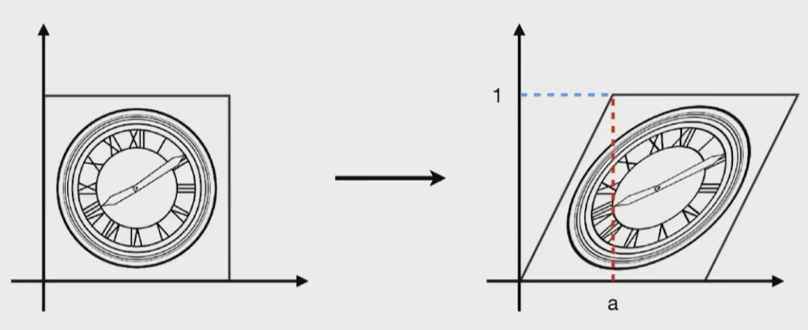
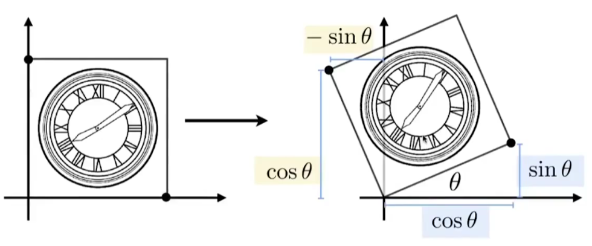

# Transformation (Lec 3&4)

**M**odel transformation (placing objects)

**V**iew transformation (placing camera)

**P**rojection transformation

​	Orthographic projection (cuboid to “canonical” cube $[-1, 1]^3$)

​	Perspective projection (frustum to “canonical” cube)

[TOC]

## 2D transformations

(Representing transformations using matrics)

### Scale 缩放

A is $S$ times of B
$$
\begin{bmatrix}
x^{\prime}\\
y^{\prime}
\end{bmatrix}
=
\begin{bmatrix}
s & 0 \\
0 & s 
\end{bmatrix}
\begin{bmatrix}
x\\y\end{bmatrix}
$$
Non-Uniform:
$$
\begin{bmatrix}
x^{\prime}\\
y^{\prime}
\end{bmatrix}
=
\begin{bmatrix}
s_x & 0 \\
0 & s_y 
\end{bmatrix}
\begin{bmatrix}
x\\y\end{bmatrix}
$$

### Reflection 反射

Horizontal reflection
$$
x^{\prime}=-x\\y^{\prime}=y
$$
its transformation matrix is
$$
\begin{bmatrix}
x^{\prime}\\y^{\prime}
\end{bmatrix}
=
\begin{bmatrix}
-1&0\\0&1
\end{bmatrix}\begin{bmatrix}
x\\y
\end{bmatrix}
$$

### Shearing 切变

Hints:

Horizontal shift is 0 at y=0

Horizontal shift is a at y=1

Vertical shift is always 0
$$
\begin{bmatrix}
x^{\prime}\\y^{\prime}
\end{bmatrix}
=
\begin{bmatrix}
1&a\\0&1
\end{bmatrix}\begin{bmatrix}
x\\y
\end{bmatrix}
$$

### Rotate 旋转

Rotate about the origin (0,0), CCW by default

$$
R
=
\begin{bmatrix}
cos\theta &-sin\theta \\sin\theta&cos\theta
\end{bmatrix}
\\
R_{-\theta}=R_\theta^T=R_\theta^T
$$

## Homogeneous coordinates 齐次坐标

Why homogeneous coordinates?

ans: We want to present transiation transformation in ONE matrics.We don’t want translation to be a special case.

Presentation:

$\begin{bmatrix}x\\y\\w\end{bmatrix}$ is the 2D point $\begin{bmatrix}
x/w\\y/w\\1
\end{bmatrix}$ 

### Translation Transformations

$$
\begin{bmatrix}
x^{\prime}\\y^{\prime}\\w^{\prime}
\end{bmatrix}
=
\begin{bmatrix}
1&0&t_x\\
0&1&t_y\\
0&0&1
\end{bmatrix}\begin{bmatrix}
x\\y\\1
\end{bmatrix}
=
\begin{bmatrix}
x + t_x\\
y+t_x\\1
\end{bmatrix}
$$

### Affine Transformations

Affine map = linear map + tanslation

Using homogenous coordinates:
$$
\begin{bmatrix}
x^{\prime}\\y^{\prime}\\1
\end{bmatrix}
=
\begin{bmatrix}
a&b&t_x\\
c&d&t_y\\
0&0&1
\end{bmatrix}\begin{bmatrix}
x\\y\\1
\end{bmatrix}
$$

### Inverse Transform $M^{-1}$

### Composing Transforms

**Ordering Matters!**

We could achieve a complex transformations by a series of simple transformations. (Matrix Multiplation)

Pre-multiply n matrices to obtain a single matrix representing combined transform.

**Decomposing Complex Transforms**

***qst:Rotate around a given point c?***

ans: Translate center to origin before rotate, and translate back.

Represent in matrics: $T(c)R(\alpha)T(-\vec c)$

## 3D Transforms

Use homogenous coordinates again:

- 3D point $=(x,y,z,1)^T$, means $(x/w,y/w,z/w)$ in general.
- 3D vector $=(x,y,z,0)^T$

Linear Transformation before translation.

### Scale and Translation

$$
S(s_x,s_y,s_z)
=
\begin{bmatrix}
s_x&0&0&0
\\
0&s_y&0&0
\\
0&0&s_z&0
\\
0&0&0&1
\end{bmatrix}
$$

$$
T(t_x,t_y,t_z)
=
\begin{bmatrix}
1&0&0&t_x
\\
0&1&0&t_y
\\
0&0&1&t_z
\\
0&0&0&1
\end{bmatrix}
$$

### Rotation

Rotation around x-axis: $R_x(\alpha)
=
\begin{bmatrix}
1&0&0&0
\\
0&cos\alpha&-sin\alpha&0
\\
0&sin\alpha&cos\alpha&0
\\
0&0&0&1
\end{bmatrix}$

Rotation around y-axis: $R_y(\alpha)
=
\begin{bmatrix}
cos\alpha&0&sin\alpha&0
\\
0&1&0&0
\\
-sin\alpha&0&cos\alpha&0
\\
0&0&0&1
\end{bmatrix}$

Rotation around z-axis: $R_z(\alpha)
=
\begin{bmatrix}
cos\alpha&-sin\alpha&0&0
\\
sin\alpha&cos\alpha&0&0
\\
0&0&1&0
\\
0&0&0&1
\end{bmatrix}$

#### Compose any 3D rotation from $R_x,R_y,R_z$

$$
R_{xyz}(\alpha,\beta,\gamma)=R_x(\alpha)R_y(\beta)R_z(\gamma)
$$

so called Euler angles.

#### Rodrigues’ Rotation Formula

Rotation by angle $\alpha$ around axis **n**

$R(n,\alpha)=cos(\alpha)I+(1-cos(\alpha))\vec n \vec n^T+sin(\alpha)\begin{bmatrix}0&-n_z&n_y\\n_z&0&-n_x\\-n_y&n_x&0\end{bmatrix}$

  

## Viewing transformation 观测变换

### View/Camera transformation 视图变换

Define the camera first:
- Position $\vec e$
- Gaze direction $\hat g$
- Up direction $\hat t$

Key observation:

​	Standard: The origin, up at Y, look at -Z

#### $M_{view}$ in math

- $M_{view}=R_{view}T_{view}$

- Translate e to origin

  $T_{view}=\begin{bmatrix}1&0&0&-x_e\\0&1&0&-y_e\\0&0&1&-z_e\\0&0&0&1\end{bmatrix}$

- Rotate g to -Z, t to Y, (g x t) to Y

  (Consider its inverse rotation)

  $R_{view}=\begin{bmatrix}x_{\hat g \times \hat t}&y_{\hat g \times \hat t}&z_{\hat g \times \hat t}&0\\x_t&y_t&z_t&0\\x_{-g}&y_{-g}& z_{-g}& 0\\0&0&0&0 \end{bmatrix}$

### Projection transformation 投影变换

Projection in CG

- 3D to 2D
- Prespective projection
- Orthographic projection

#### Orthographic Projection

Simple way to understanding:

- Camera located at origin, looking at -Z, up at Y (looks familiar?) 
- Drop Z coordinate
- Translate and scale the resulting rectangle to $[-1, 1]^2$

In general:

- Translate(center to origin) first, then scale.
  

- Transformation matrix

  $$
  M_{thoro}=
  \begin{bmatrix}
  \frac{2}{r-l}&0&0&0\\
  0&\frac{2}{t-b}&0&0\\
  0&0&\frac{2}{n-f}&0\\
  0&0&0&1
  \end{bmatrix}
  \begin{bmatrix}
  1&0&0&-\frac{r+l}{2}\\
  0&1&0&-\frac{t+b}{2}\\
  0&0&1&-\frac{n+f}{2}\\
  0&0&0&1
  \end{bmatrix}
  $$
  
- Caveat

  - Looking at / along -Z is making near and far not intuitive (n > f)
  - FYI: that’s why OpenGL (a Graphics API) uses left hand coords

#### Perspective Projection

Recall of homogenous coordinates

- (x, y, z, 1), (kx, ky, kz, k != 0), (xz, yz, z2, z != 0) all represent  the same point (x, y, z) in 3D 

  e.g. (1, 0, 0, 1) and (2, 0, 0, 2) both represent (1, 0, 0)

$$
M_{persp}=M_{ortho}M_{persp\rightarrow ortho}\\
M_{persp\rightarrow ortho}=
\begin{bmatrix}
n&0&0&0\\
0&n&0&0\\
0&0&n+f&-nf\\
0&0&1&0
\end{bmatrix}
$$

如何定义视锥 

Convert from fovY and aspect to l, r, b, t?

- Tirvial

  

  fovY: 垂直可视角度

- 
